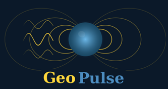

<p align="center">
  
</p>

# GeoPulse

*Unified engine for geomagnetically induced currents across grounded infrastructure.*

[](https://github.com/shibaji7/geopulse/actions/workflows/ci.yml)
[](https://geopulse.readthedocs.io/en/latest/)
[](https://pypi.org/project/geopulse/)
[](https://pypi.org/project/geopulse/)
[](https://codecov.io/gh/shibaji7/geopulse)
[](LICENSE)
[](https://github.com/pre-commit/pre-commit)
[](https://github.com/astral-sh/ruff)

GeoPulse computes geomagnetically induced currents (GIC), induced voltages,
and total harmonic distortion (THD) across grounded infrastructure —
submarine cables, power grids, oil/gas pipelines, and electrified railways —
from a single, modular, extensible core. Every stage carries uncertainty via
the `Uncertain[T]` type, and the surface impedance `Z` is a single
polymorphic abstraction spanning 1-D scalar, 2-D tensor, and 3-D kernel
representations. The engine is intended to be an open, reproducible reference
implementation that ships alongside peer-reviewed papers.

## Architecture

```
   SOURCES         EARTH           E-FIELD         NETWORK          SOLVER          DEVICES         METRICS
  ┌────────┐    ┌────────┐      ┌──────────┐    ┌──────────┐    ┌──────────┐    ┌──────────┐    ┌──────────┐
  │SuperMAG│    │ 1-D    │      │Plane-wave│    │Cables    │    │LPM       │    │Transform.│    │GIC / THD │
  │INTERMAG│──▶│ Layered│  ──▶ │Convolut. │──▶│Power grid│──▶ │MNA       │──▶│CP units  │──▶│Hotspot   │
  │SWMF MHD│    │ 2-D    │      │Coastal   │    │Pipelines │    │PySpice   │    │Rectifier │    │Exceedance│
  │Synth.  │    │ 3-D    │      │Non-unif. │    │Railways  │    │          │    │          │    │          │
  └────────┘    └────────┘      └──────────┘    └──────────┘    └──────────┘    └──────────┘    └──────────┘
       B(t)   →   σ(r)     →     E(r,t)     →   V_th=∫E·dℓ   →   I=(1+Y·Z)⁻¹Jₑ  →   i_m(λ)    →   THD
```

## Installation

Four supported install paths:

```bash
# 1. Core only — minimal, for reproduction (six deps: numpy, scipy,
#    matplotlib, h5py, pyyaml, loguru)
pip install geopulse

# 2. With optional data tools (xarray, netCDF4, pandas)
pip install geopulse[data]

# 3. Full development environment (conda + editable + pre-commit)
git clone https://github.com/shibaji7/geopulse.git
cd geopulse
conda env create -f environment.yml
conda activate geopulse-dev
pip install -e ".[dev]"
pre-commit install

# 4. Paper-reproduction environment (pinned)
conda env create -f environment-minimal.yml
conda activate geopulse
python examples/reproduce_horton2012.py
```

Available optional extras: `[data]`, `[viz]`, `[earth3d]`, `[spice]`,
`[service]`, `[dev]`, `[all]`.

## Quick start (Phase 1+ — the smoke-test chain)

```python
from geopulse.sources.synthetic import SyntheticSource
from geopulse.earth.library import get_model
from geopulse.efield.planewave import compute_efield_planewave
from scipy.fft import irfft
import matplotlib.pyplot as plt

# 1. Gaussian B-field pulse (500 nT peak, 1 h window, 1 Hz sampling)
source = SyntheticSource(waveform="gaussian_pulse", amplitude_nT=500.0)
b_data = source.load(start_s=0, end_s=3600, dt_s=1.0)

# 2. Load a 1-D Earth model and compute surface impedance
earth = get_model("quebec_7layer")
freqs, Bx_f, By_f = source.to_frequency_domain(b_data)
impedance = earth.compute_impedance(freqs)

# 3. Plane-wave E-field
Ex_f, Ey_f = compute_efield_planewave(freqs, Bx_f, By_f, impedance)
Ex_t = irfft(Ex_f, n=len(b_data.time_s))

# 4. Plot
fig, axes = plt.subplots(2, 1, sharex=True)
axes[0].plot(b_data.time_s / 60, b_data.bx_T * 1e9, label="Bx (nT)")
axes[1].plot(b_data.time_s / 60, Ex_t * 1e3,       label="Ex (mV/m)")
plt.savefig("first_gic.png")
```

*Note: this quick-start runs after Phase 1 lands. Phase 0 ships the scaffold,
constants, exceptions, ABCs, `Impedance`, `Uncertain[T]`, HDF5 I/O, config,
and CLI.*

## Infrastructure targets

* Submarine cables (SCUBAS refactor → `geopulse.network.cable`)
* Bulk power grids (`geopulse.network.powergrid`)
* Oil & gas pipelines with DSTL (`geopulse.network.pipeline`)
* Electrified railways with track circuits (`geopulse.network.railway`)

## Contributing

See [CONTRIBUTING.md](CONTRIBUTING.md) for the branch model, commit
conventions, PR checklist, and coding standards.

## Citation

If you use GeoPulse in your research, please cite:
*Chakraborty, S. & Boteler, D. (in preparation). GeoPulse: A unified engine
for geomagnetically induced currents across grounded infrastructure.*

## License

[Apache-2.0](LICENSE). The explicit patent grant is deliberate — GeoPulse is
intended for use by industry partners as well as academics.

## Acknowledgments

Principal Investigator: **Shibaji Chakraborty** (ERAU / CSAR).
Primary Collaborator: **David Boteler** (NRCan Geomagnetism).
